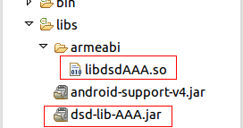

## 集成前准备
到[大数点开发者平台](https://dev.dasudian.com/)注册成为大数点合作伙伴并创建应用。

## 下载SDK
到[大数点官网](http://main.dasudian.com/downloads/sdk/latest/)下载AAA SDK。

## SDK内容

 - dsd-lib-AAA.jar
 - libdsdAAA.so
 
## 配置工程
### 导入库和jar包
拷贝libdsdAAA.so到libs/armeabi目录下，如果没有armeabi目录，请手动创建该目录。
拷贝dsd-lib-AAA.jar到libs目录下，如下图所示。<br/>


### 配置权限
如下图所示,在AndroidManifest.xml中加入如下内容使能必要的访问权限.
```xml
<uses-permission android:name="android.permission.INTERNET"/>
<uses-permission android:name="android.permission.WRITE_EXTERNAL_STORAGE"/>
<uses-permission android:name="android.permission.ACCESS_NETWORK_STATE" />
<!-- 读写联系人 -->
<uses-permission android:name="android.permission.READ_CONTACTS" />
<uses-permission android:name="android.permission.WRITE_CONTACTS" />
```

## 使用SDK
### 初始化SDK
在开始调用后面的api之前需要使用该函数初始化sdk，只有初始化sdk成功后，调用后面的api才能成功。
该函数主要用于大数点对用户信息进行验证。
```java
/**
 * 初始化sdk
 * @param aucServer auc服务器地址
 * @param appId     在大数点开发者平台创建应用时获得
 * @param appKey	在大数点开发者平台创建应用时获得
 * @return 成功：0 失败：非0
 */
public static native int dsdAAAInit(String aucServer, String appId, String appKey);
```

### 验证手机号
验证手机号由下面两步组成，第一步发送手机号到服务器去获取验证码。
第二步将收到的验证码和手机号一同提交到服务器，验证手机号码的正确性。
```java
/**
 * 发送手机号，获取验证码
 * @param phoneNumber 手机号
 * @return json格式字符串，eg：成功{"result":"success","veri_code":"xxxxx"}，失败{"result":"fail","reason":"reason..."}
 */
public static native String dsdAAARegisterPhoneNumber(String phoneNumber);
```

```java
/**
 * 发送手机号和验证码，验证手机号码的正确性。
 * @param phoneNumber 手机号
 * @param code		  收到的验证码
 * @return  json格式字符串，eg：成功{"result":"success"}，失败{"result":"fail","reason":"reason..."}	  
 */
public static native String dsdAAAVerifyPhoneNumber(String phoneNumber, String code);
```

### 注册用户信息
手机号码验证通过后，就可以开始注册用户信息了。
```java
/**
 * 注册用户个人信息到服务器
 * @param phoneNumber 电话号码
 * @param veriCode    验证码，使用dsdAAARegisterPhoneNumber获得的验证码。
 * @param name        用户昵称，可在登录后修改
 * @param sex         性别，0其它，1男,2女
 * @param birthday    生日,已-分隔，提交后不可修改。eg：1992-10-15，
 * @param password    密码，由字母数字下划线组成，可修改。
 * @param email       邮箱
 * @param province    省。eg：广东
 * @param city        市。eg：深圳
 * @param device      设备类型，如："xiaomi5","iphone5s"
 * @param signature   个性签名，可修改。eg：大数据点亮生活。
 * @return json格式字符串，eg：成功{"result":"success"}，失败{"result":"fail","reason":"reason..."}
 */
public static String dsdAAARegister(String phoneNumber, String veriCode, 
					String name, int sex, String birthday,
					String password, String email, String province, String city,
					String device, String signature);
```

### 登录

注册用户信息成功后，就可以使用手机号码和注册时的密码登录了。

```java
/**
 * 登录。注册成功后，就可以使用注册时得手机号和密码登录了。
 * 登录成功后，在成功的json字符串里面会返回cookie。
 * 开发者需要将该cookie保存起来，在下一次登录时，使用api dsdAAAAutoLogin传入保存的cookie即可快速登录，
 * 不需要再重新提交电话号码和密码来登录。
 * @param phoneNumber  手机号
 * @param password     密码
 * @return json格式字符串，eg：成功{"result":"success","cookie":"cookie content...."}，
 * 失败{"result":"fail","reason":"reason..."}
 */
public static native String dsdAAALogin(String phoneNumber, String password);
```

```java
/**
 * 使用cookie自动登录
 * @param cookie 登录成功时返回的cookie。使用账号密码登录成功后，系统会返回cookie。
 * 开发者将该cookie保存下来并传入该api即可实现用户快速登录。
 * @return json格式字符串，eg：成功{"result":"success"}，失败{"result":"fail","reason":"reason..."}
 */
public static native String dsdAAAAutoLogin(String cookie);
```

### 获取用户信息

登录成功后，调用该api获取用户注册时提交的信息。

```java
/**
 * 获取用户信息，调用该api前需要先登录。
 * @param phoneNumber
 * @return json格式字符串         
 */
public static native String dsdAAAGetUser(String phoneNumber);
```

返回值如下
```
成功：
{
	"result":"success",
	"info":{
		"name":"张三",
		"birthday":"1992-10-15",
		"sex":"男",
		"phone_num":"18288888888",
		"email":"lw@dasudian.com",
		"country":"undefined",
		"province":"广东",
		"city":"深圳",
		"avatar":"97O0HUYQGP2VX56rA0",
		"signature":"大数据点亮生活",
		"last_login":"2016-04-21T06:04:32.985Z",
		"device":"undefined",
		"login_counter":"30",
		"type":"0"
	}
}
失败{"result":"fail","reason":"reason..."} 
```

### 修改个人信息

登录成功后，通过该api设置自己的头像。
```java
/**
 * 上传头像，该方法是同步方法，可能会阻塞主线程。
 * @param imagePath  图片路径
 * @return json格式字符串，eg：成功{"result":"success","portrait":"8vcKSfPVD9U1jR5EAq"} 
 * 失败{"result":"fail","reason":"reason..."}
 */
public static native String dsdAAASetIcon(String imagePath);
```

登录成功后，通过该api修改昵称
```java
/**
 * 修改昵称，需要先登录。
 * @param newName 新昵称
 * @return json格式字符串，eg：成功{"result":"success"}，失败{"result":"fail","reason":"reason..."}
 */
public static native String dsdAAAChangeName(String newName);
```

登录成功后，通过该api修改个性签名
```java
/**
 * 修改个性签名，需要先登录。
 * @param signature 新的个性签名
 * @return json格式字符串，eg：成功{"result":"success"}，失败{"result":"fail","reason":"reason..."}
 */
public static native String dsdAAAChangeSignature(String signature);
```

登录成功后，通过该api修改密码
```java
/**
 * 修改密码，需要先登录。
 * @param oldPasswd 旧密码
 * @param newPasswd 新密码
 * @return json格式字符串，eg：成功{"result":"success"}，失败{"result":"fail","reason":"reason..."}
 */
public static native String dsdAAAChangePasswd(String oldPasswd, String newPasswd);
```

### 忘记密码
当用户忘记密码后，需要下面两步找回密码。
1. 通过手机号获取验证码
2. 发送验证码和新的密码到服务器设置新密码

```java
/**
 * 获取验证码，用于忘记密码时修改密码使用。
 * @param phoneNumber 电话号码
 * @return json格式字符串，eg：成功{"result":"success","veri_code":"pinysl"}，
 * 失败{"result":"fail","reason":"reason..."}
 */
public static native String dsdAAARequestVericode(String phoneNumber);
```

```java
/**
 * 忘记密码，通过上一个api获取到验证码过后，可以使用该函数设置新的密码了。
 * @param phoneNumber 电话号码
 * @param verifyCode  发送到手机上的验证码
 * @param newPasswd   新密码
 * @return json格式字符串，eg：成功{"result":"success"}，失败{"result":"fail","reason":"reason..."}
 */
public static native String dsdAAAForgetPassword(String phoneNumber, String verifyCode, String newPasswd);
```

### 同步联系人
通过下面两个api可以同步联系人到服务器和从服务器下载联系人

```java
/**
 * 同步联系人到服务器，需要先登录。该api的作用是上传手机联系人到服务器后，
 * 调用dsdAAAGetContact可以获取到有哪些联系人也在使用该服务。
 * @param contacts 联系人列表，必须是json数组格式。
 * eg:["18288888888","18288888888"，"+8618288888888"...]
 * @return json格式字符串，eg：成功{"result":"success"}，失败{"result":"fail","reason":"reason..."}
 */
public static native String dsdAAASyncContact(String contacts);
```

```java
/**
 * 获取联系人列表，需要先登录。同步联系人过后，就可以调用该方法获取在联系人当中有哪些联系人也注册了该app。
 * @param phoneNumber  登录时的电话号码
 * @return json格式字符串，{"result":"success","phone_number":"13618074451","contacts", 
 * ["13761975289","+8618565618719","18565618719"]}}
 */
public static native String dsdAAAGetContact(String phoneNumber);
```

### 第三方登录
qq登录

```java
/**
 * 上传qq用户的信息到服务器
 * @param openId        qq登录授权后返回的openid
 * @param accessToken   qq登录授权后返回的access_token
 * @param appId         qq开发者网站申请的appid
 * @param device        用户使用的设备类型，eg："xiaomi4"
 * @return   json格式字符串，eg：{"result":"success","user_id":"9F058B842A48B5EE2419CCB2E53DB2FF"}
 */
public static native String dsdAAAqq(String openId, String accessToken, String appId, String device);
```

微信登录
```java
/**
 * 上传微信用户的信息到服务器
 * @param openId        微信登录授权后返回的openid
 * @param accessToken   微信登录授权后返回的access_token
 * @param appId         微信开发者网站申请的appid
 * @param device        用户使用的设备类型，eg："xiaomi4"
 * @return   json格式字符串，eg：{"result":"success","user_id":"9F058B842A48B5EE2419CCB2E53DB2FF"}
 */
public static native String dsdAAAwechat(String openId, String accessToken, String appId, String device);
```

```java
/**
 * 从服务器拉取用户信息
 * @param openId qq或则微信授权后返回的openid
 * @return  json格式字符串
 */
public static native String dsdAAAOauthUserInfo(String openId);
返回值eg：
{
	"name":"Yy",
	"birthday":"undefined",
	"sex":"男",
	"phone_num":"undefined",
	"email":"undefined",
	"country":"undefined",
	"province":"广东",
	"city":"深圳",
	"avatar":"http://q.qlogo.cn/qqapp/222222/9F058B842A48B5EE2419CCB2E53DB2FF/100",
	"status":"active",
	"signature":"undefined",
	"joined":"2016-04-21T10:48:21.735Z",
	"last_login":"2016-04-21T10:48:21.735Z",
	"device":"android",
	"login_counter":"0",
	"type":"1"
}

```

## 下载Android示例程序
[下载Android示例程序](https://github.com/Dasudian/aaasdk-example-android)
